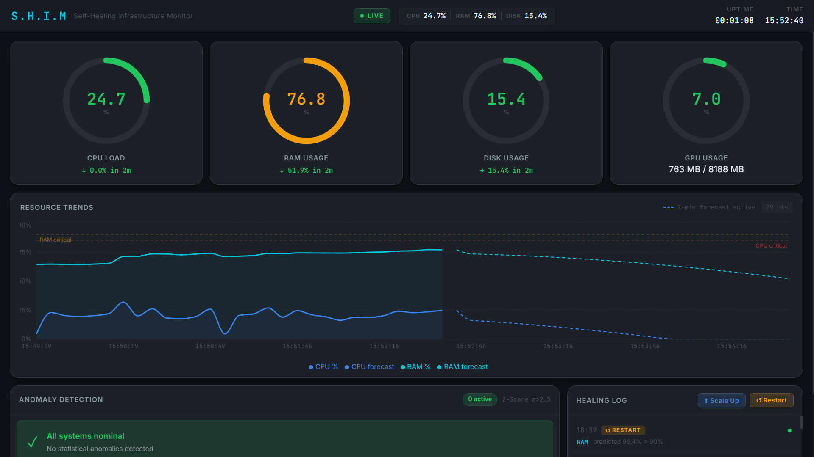

# 🚀 P.R.I.S.M - Predictive Resource Intelligence & Scaling Manager

> AIOps system that **predicts failures and heals automatically** using ML + real system actions.

---

## 📸 Dashboard Preview



---


## 🧠 Core Idea

```text
Observe → Predict → Decide → Act
```

## 🔥 Highlights

* 📊 CPU, RAM, Disk, **GPU monitoring**
* 🔮 ML prediction (5 min ahead)
* ⚠️ Z-score anomaly detection
* 🛠️ Auto healing (PM2 scale + restart)
* ⚡ Real-time updates (WebSockets)
* 💾 Persistent storage (CSV)

---

## ⚙️ Requirements

### 🔍 Verify GPU Support
```bash
nvidia-smi
```

### 🔍 Verify Docker GPU Access
```bash
docker run --rm --gpus all nvidia/cuda:12.4.1-base-ubuntu22.04 nvidia-smi
```
• 👉 If both work → you're fully ready.

• 👉 You’re good. Skip to Docker setup.

-------------------------------------------------------------------------------------------------------------------

### ❌ If Command Not Found / No GPU Detected please follow below steps:-  

• 👉 Install and configure NVIDIA + Docker support:

### ⚙️ Step 1: Install Docker
```bash
 sudo apt update
 sudo apt install -y ca-certificates curl gnupg
 sudo install -m 0755 -d /etc/apt/keyrings
```

### 🔄 Step 2: Restart Docker Services
```bash
 sudo systemctl daemon-reexec
 sudo systemctl daemon-reload
 sudo systemctl restart docker
 curl -fsSL https://download.docker.com/linux/ubuntu/gpg | \
 sudo gpg --dearmor -o /etc/apt/keyrings/docker.gpg
 echo \
`"deb [arch=$(dpkg --print-architecture) signed-by=/etc/apt/keyrings/docker.gpg] \
`https://download.docker.com/linux/ubuntu \
`$(. /etc/os-release && echo $VERSION_CODENAME) stable" | \
`sudo tee /etc/apt/sources.list.d/docker.list > /dev/null
 sudo apt update
```

### 🎯 Step 3: Install NVIDIA Container Toolkit
```bash
 sudo apt install -y nvidia-container-toolkit
 #configure runtime:
 sudo nvidia-ctk runtime configure --runtime=docker
 sudo systemctl restart docker
```
### 🧪 Step 4: Verify GPU Inside Docker
```bash
 sudo docker run --rm --gpus all nvidia/cuda:12.4.1-base-ubuntu22.04 nvidia-smi
```

### ✅ Expected:
- GPU name
- Memory usage
- Driver version 
👉 If this works → Docker GPU setup is correct

📦 Step 6: Install Docker Compose Plugin
```
 sudo apt install -y docker-compose-plugin
```

---

## 🚀 Run Project (Docker)
```
    docker compose up -d --build
```
* 👉 Open: http://localhost

### Stop, Restart && Clean (Docker)
```
    # Docker stop
    docker compose down

    # Docker restart
    docker compose restart

    # Clean(reset everything)
    docker compose down -v
    docker system prune -a
```

---

## 🛠️ Setup for Local Usage without using Docker's

### 🔹 1. Backend (IMPORTANT: Use PM2)

```bash
cd backend
npm install

# Start backend with PM2 (required for real healing)
pm2 start src/index.js --name shim 

# Stop the app PM2 if u want
pm2 stop shim
```

### 🛑 Managing PM2 (IMPORTANT)

```bash
# Check running processes
pm2 list
# Monitor CPU / Memory live
pm2 monit
# Stop the app
pm2 stop shim
# Restart the app
pm2 restart shim
# Delete the app completely (recommended when done)
pm2 delete shim
# Stop all apps
pm2 stop all
```

### ⚠️ Note

* Do NOT use `npm run dev` when testing healing
* PM2 must control the process for scaling & restart to work

### 🔹 2. ML Service

```bash
cd ml
pip install -r requirements.txt
python predictor.py
```

### 🔹 3. Frontend

```bash
cd frontend
npm install
npm run dev
```

👉 Open: http://localhost:5173

-------------------

## 📊 What it does
### Monitoring (every 5s)
* CPU %
* RAM %
* Disk %
* GPU %
* GPU memory (used / total)

## ⚙️ Services

| Service  | Tech                          | Port |
| -------- | ----------------------------- | ---- |
| Frontend | React + Vite                  | 5173 |
| Backend  | Node.js + Express + Socket.IO | 3001 |
| ML       | Python + Flask + Sklearn      | 5000 |

## Prediction
* Forecast next 5 minutes
* Trend: increasing / decreasing / stable
* Confidence: low / medium / high

## Healing 
* 👉 Max instances = 4
* 👉 Cooldown = 3 min

* ⚠️ GPU → monitoring only

## 🧠 Flow
* Collect → Detect → Predict → Heal → Update UI

## 📦 Data
* metrics.csv
* healing_log.csv

## 🔌 API
* /api/metrics/current
* /api/metrics/history
* /api/metrics/predictions
* /api/metrics/anomalies
* /api/healing/log
* /api/healing/cooldowns
* /api/healing/trigger

### Healing

| Method | Endpoint                 | Description     |
| ------ | ------------------------ | --------------- |
| GET    | `/api/healing/log`       | Healing history |
| GET    | `/api/healing/cooldowns` | Cooldown status |
| POST   | `/api/healing/trigger`   | Manual trigger  |

## ⚡ Real-Time Events

| Event            | Description                        |
| ---------------- | ---------------------------------- |
| `healing_update` | Emitted when healing action occurs |


## ⚡ Real-time
## Event:
* healing_update

## 🎯 Why this is strong
* Real system actions (not simulation)
* ML-driven decisions
* Event-driven architecture
* Dockerized + GPU-ready


## 👨‍💻 Author

* Varshith
* IIT Hyderabad

* Built as an AIOps system demonstrating **self-healing infrastructure principles** using modern full-stack + ML integration.

## 📬 Contact
### For queries, updates, or collaboration:
  
* Name: Varshith
* Email: co25btech11016@iith.ac.in

